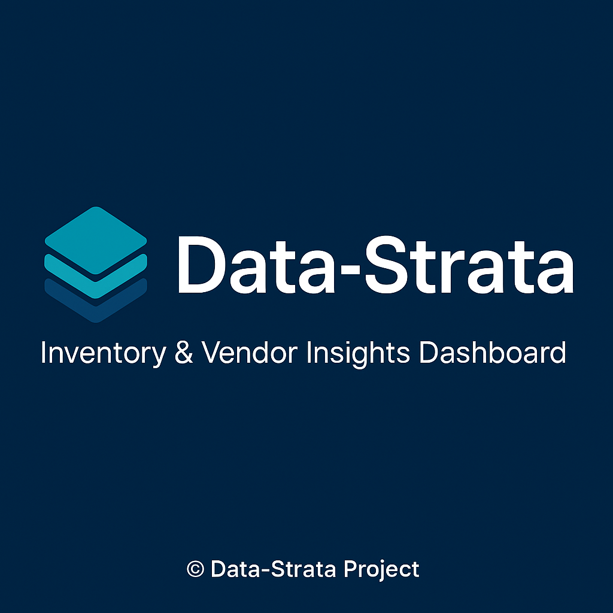
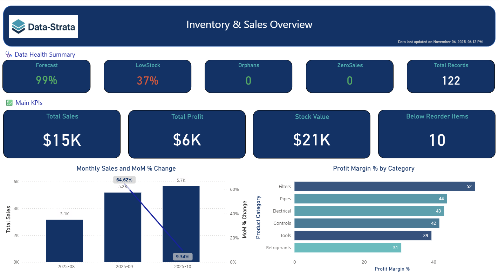
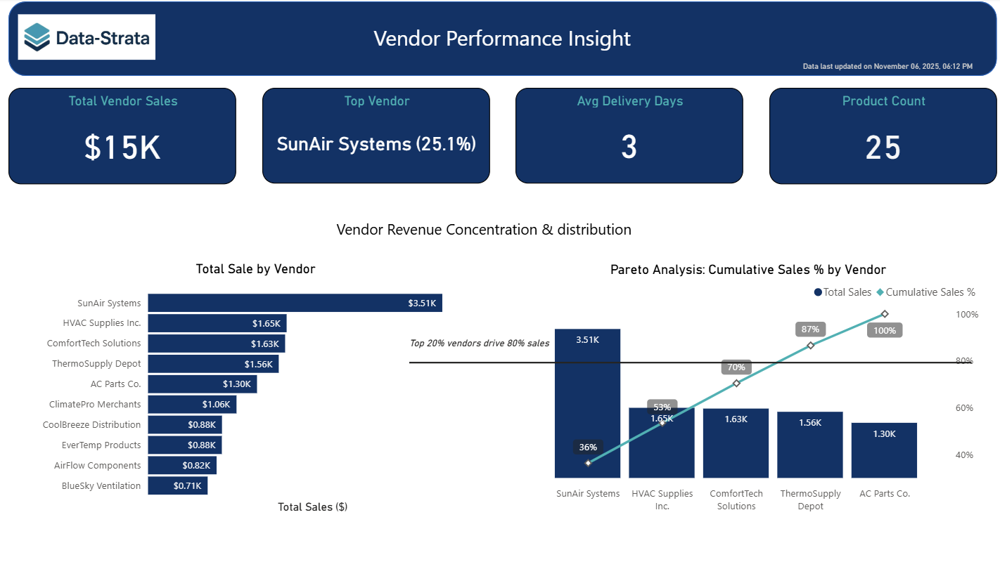
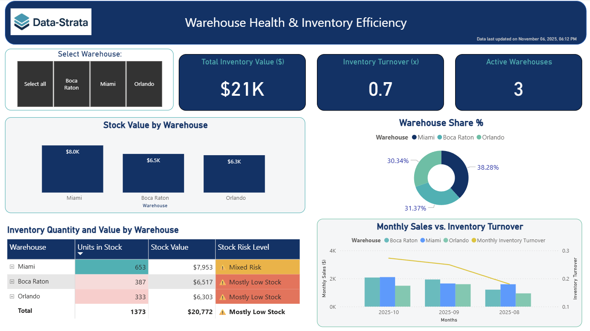
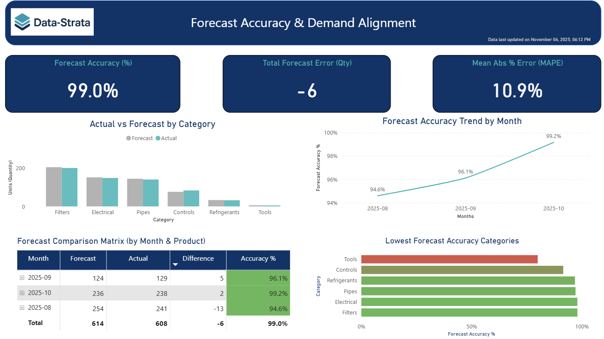
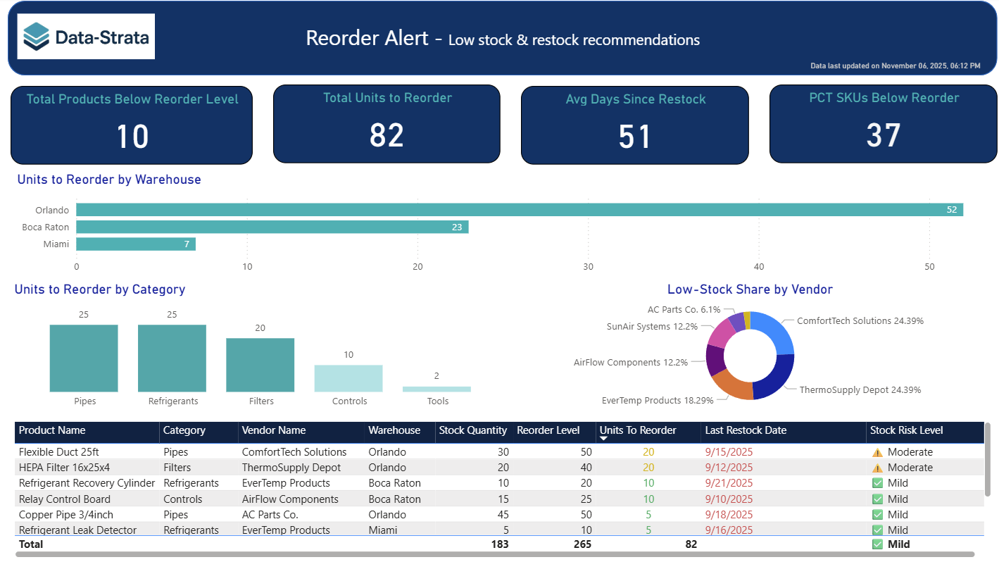
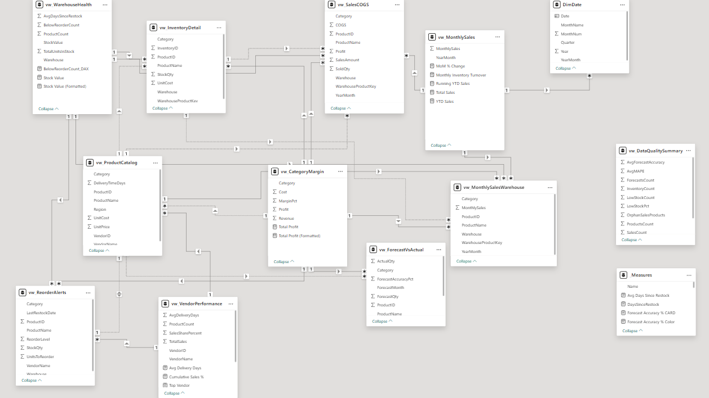

# 🧮 Data-Strata: Inventory & Vendor Insights Dashboard  

> **End-to-end SQL + Power BI solution for inventory, vendor, and profitability insights — turning raw data into actionable business intelligence.**  

---

**Data-Strata** is a full-stack data analytics project that demonstrates how SQL and Power BI can transform raw operational data into strategic business insights.  
Using simulated HVAC parts and vendor data, it models a complete workflow — from CSV ingestion and SQL data modeling to automated analytical views and interactive Power BI dashboards.  

The project applies real-world BI concepts such as inventory turnover analysis, vendor performance tracking, profit-margin diagnostics, and forecast-accuracy monitoring.  
Each SQL view represents a modular analytical layer, allowing for transparent, reusable logic across dashboards.  

The result is a portfolio-ready case study showing how a data analyst can design scalable reporting systems that support data-driven decisions on stock optimization, supplier reliability, and profitability improvement.  

Data-Strata illustrates not just *how* to build analytical solutions, but *why* they matter for modern business operations.

---
## 🌟 Project Overview

**Data-Strata** demonstrates how to design an **end-to-end data analytics pipeline**:
1. **Data modeling** in SQL Server  
2. **Automated view layer** for KPIs  
3. **Interactive Power BI dashboards** for executives and operations teams  

All data is generated from mock CSV files under `/data/`, processed through SQL views, and visualized in Power BI.

---

## 🛠️ Tech Stack

| Layer | Tools & Technologies |
|-------|----------------------|
| **Database** | Microsoft SQL Server 2019+ |
| **Data Transformation** | SQL Views & Aggregations |
| **Visualization** | Power BI Desktop |
| **Data Sources** | Mock CSVs (Vendors, Products, Inventory, Sales, Forecasts) |
| **Version Control** | Git + GitHub |

---

## 🎯 Objectives

- Identify **high-performing vendors and categories**
- Monitor **inventory turnover** and **stock risk levels**
- Forecast and compare **demand accuracy**
- Track **profit margins** by product category
- Generate **reorder alerts** by warehouse

---

## 📈 Key KPIs

| Category | KPI |
|-----------|-----|
| **Sales & Profitability** | Total Sales, Total Profit, Profit Margin %, MoM % Change |
| **Inventory & Warehouse** | Stock Turnover, Inventory Value, Reorder Alerts, Stock Risk Level |
| **Vendor Performance** | On-Time Delivery %, Avg Delivery Days, Cost Variance |
| **Forecast Accuracy** | Forecast vs Actual, Mean Absolute % Error (MAPE) |

---

## 📊 Power BI Dashboard Pages

| Page | Focus |
|------|--------|
| **1. Overview** | Company-wide KPIs and sales trend |
| **2. Vendor Performance** | Vendor reliability and delivery metrics |
| **3. Warehouse Health** | Stock efficiency and turnover by warehouse |
| **4. Forecast Accuracy** | Forecast vs Actual accuracy trend |
| **5. Category Profit Margin** | Profitability by category and product |
| **6. Reorder Alerts** | Products below reorder levels |

---

## 📸 Dashboard Previews


| Overview | Vendor Performance |
|-----------|--------------------|
|  |  |

| Warehouse Health | Forecast Accuracy |
|------------------|-------------------|
|  |  |

| Category Profit Margin | Reorder Alerts |
|--------------------------|----------------|
|  |  |

*(Full-resolution images are available in `/assets/screenshots/`.)*

---

## 🧱 Data Model Diagram

The diagram below shows how all SQL views and base tables connect within Power BI.  
It illustrates the logical flow of data from the raw sources through analytical views and into the KPI dashboards.



> *Data-Strata logical model: all analytical views feed into the six Power BI dashboard pages.*


*Diagram exported from Power BI Model view (Relationships tab).*

---

## 🧩 Architecture Summary

The Power BI data model is organized into three logical layers:

1. **Core Analytical Layer** — relational SQL views joined through common keys  
   (`vw_ProductCatalog`, `vw_InventoryDetail`, `vw_MonthlySalesWarehouse`,  
   `vw_WarehouseHealth`, `vw_CategoryMargin`, `vw_ReorderAlerts`, etc.).  
   These views form the main star-like structure used for dashboard relationships.

2. **Helper Tables** — dimension-style tables that support calculations and navigation:  
   - `DimDate`: provides continuous monthly and yearly context for MoM and YTD trends.  
   - `_Measures`: a dedicated table that stores global DAX measures (for organization).

3. **Standalone Quality & Utility Views** — used for model health and meta-analysis:  
   - `vw_DataQualitySummary`: returns one aggregated row with QA metrics  
     (row counts, low-stock %, forecast accuracy, orphan checks).  
   - These objects are intentionally **not linked** to the core model —  
     they feed summary cards such as *Data Health Summary* on the Overview page.

> *Together, these layers ensure clean relationships for performance KPIs while keeping QA and global logic isolated from transactional joins — a best-practice hybrid between star-schema and semantic modeling.*

---

## 📁 Repository Structure

```text
Data-Strata/
│
├── README.md                          # Root README (project overview, KPIs, insights)
├── LICENSE                            # MIT license
│
├── data/                              # Mock CSV datasets
│   ├── vendors.csv
│   ├── products.csv
│   ├── inventory.csv
│   ├── sales.csv
│   ├── forecasts.csv
│   └── README.md                      # Data dictionary + import instructions
│
├── PowerBI/                           # Dashboards
│   └── Data-Strata_Dashboard.pbix     # Final Power BI file (6 pages)
│
├── assets/
│   └── screenshots/                   # Dashboard previews for GitHub
│       ├── overview_page.png
│       ├── vendor_performance.png
│       ├── warehouse_health.png
│       ├── forecast_accuracy.png
│       ├── category_margin.png
│       ├── reorder_alerts.png
│       └── data_model_diagram.png
│
├── SQL/
│   │
│   ├── schema/                        # Base table definitions (Vendors, Products, Inventory, Sales, Forecasts)
│   │   └── create_tables.sql          
│   │
│   ├── data_load/                     
│   │   ├── BulkUpdate.sql             # BULK INSERT loader for CSVs
│   │   └── README.md                  # Notes for running BulkUpdate and file-path setup
│   │
│   ├── queries/                       # Analytical SQL layer & QA scripts
│   │   ├── vw_ProductCatalog.sql
│   │   ├── vw_InventoryDetail.sql
│   │   ├── vw_MonthlySales.sql
│   │   ├── vw_MonthlySalesWarehouse.sql
│   │   ├── vw_VendorPerformance.sql
│   │   ├── vw_WarehouseHealth.sql
│   │   ├── vw_ForecastVsActual.sql
│   │   ├── vw_SalesCOGS.sql
│   │   ├── vw_CategoryMargin.sql
│   │   ├── vw_ReorderAlerts.sql
│   │   ├── vw_DataQualitySummary.sql  # one-row summary view for data health KPIs
│   │   ├── RunOrderedViews.sql        # Test ordered output of all metrics
│   │   ├── TestDataChecks.sql         # Data quality / sanity checks
│   │   └── README.md                  # Explains RunOrderedViews & TestDataChecks
│   │
│   ├── create_views_master.sql        # Optional: sequential script to rebuild all views
│   ├── DataStrata_RefreshAll.sql      # Master pipeline (schema + data load + views)
│   └── README.md                      # SQL Documentation (view purpose, diagrams, usage notes)
│
└── .gitignore                         # Ignores .pbix, temp files, local CSVs

```

---

## ⚙️ Quick Start

### 🧱 Base Schema

Before loading data, run:

```sql
:r .\schema\create_tables.sql
```

1. **Load mock data**
   - Update file paths in `SQL/data_load/BulkUpdate.sql`
   - Execute it to populate all base tables
   ```sql
   :r .\SQL\data_load\BulkUpdate.sql
   ```

2. **Build analytical views**
   - Run 
  ```sql
  :r .\SQL\data_load\BulkUpdate.sql
  ```
   - Or execute the full pipeline  
     ```sql
     :r .\SQL\DataStrata_RefreshAll.sql
     ```  

3. **Connect Power BI**
   - Open `PowerBI/Data-Strata_Dashboard.pbix`
   - Refresh data connections (point to your SQL Server instance)

4. **Explore dashboards**
   - Navigate through each page for KPIs, trends, and alerts.

---

## 🧠 Data Model (Simplified)

Vendors ─┬─> vw_ProductCatalog ─┬─> vw_InventoryDetail
│ ├─> vw_SalesCOGS ─┬─> vw_CategoryMargin
│ ├─> vw_ReorderAlerts
│ └─> vw_VendorPerformance
Inventory ───────────────────────┬─> vw_WarehouseHealth
Sales ───────────────────────────┼─> vw_MonthlySales
└─> vw_MonthlySalesWarehouse
Forecast ────────────────────────└─> vw_ForecastVsActual


---

## 🧩 Features

- **End-to-End Data Flow** — CSV → SQL Tables → Analytical Views → Power BI  
- **Automated Refresh** — one-click rebuild using `DataStrata_RefreshAll.sql`  
- **Dynamic DAX** — MoM %, YTD, Forecast Accuracy, Running Totals  
- **Advanced SQL** — joins, aggregations, conditional logic, views for layered reporting  
- **Portfolio-Ready** — modular structure, documented SQL, clean visuals

---

## 🚀 Next Steps / Future Enhancements

While the current version of **Data-Strata** provides a complete, functional analytics workflow, several improvements could extend its capabilities:

- **Automated Data Refresh Pipeline** – Schedule refreshes via SQL Server Agent or Power BI Service.  
- **Parameterization for Real Data** – Connect to Azure SQL or ERP APIs for live input.  
- **Extended Dimensional Modeling** – Add `DimVendor` / `DimWarehouse` to build a complete star schema.  
- **Advanced Forecasting** – Integrate Python or Power BI AutoML for predictive modeling.  
- **Interactive Data Health Dashboard** – Expand QA metrics into a trend-based data quality page.

> *Each of these enhancements builds on the existing SQL + Power BI foundation, strengthening automation, scalability, and analytical depth.*

---

## 🔍 Insights & Findings

After building and analyzing the dashboards, several operational and business insights emerged:

### 🏭 Inventory & Warehouse
- Warehouses showed clear differences in **stock balance and turnover rates**, indicating that some locations could benefit from refined reorder points or updated safety stock parameters.  
- The **Stock Risk Level** view provides early warnings for both under-stocked and over-stocked items, allowing warehouse teams to act proactively and avoid inventory imbalances.  
- **Reorder Alerts** highlight the specific products and quantities required to maintain service levels without tying up excess capital.

### 📦 Vendor Performance
- Vendors varied in **delivery speed, reliability, and cost variance**, offering a data-driven foundation for supplier scorecards.  
- Analyzing **on-time delivery percentage** alongside **average delivery days** helps identify partners that consistently meet SLAs versus those that cause downstream inventory issues.  
- Integrating these metrics with purchasing decisions can strengthen vendor relationships and improve supply-chain stability.

### 📊 Sales & Profitability
- **Category-level profitability** analysis revealed that some product categories achieve high sales volumes but low margins, while others generate strong profits from smaller volumes.  
- **Month-over-Month (MoM)** and **Year-to-Date (YTD)** trends make it easy to visualize seasonality, product performance, and emerging growth areas.  
- The combination of SQL and Power BI enables quick margin diagnostics at both category and product level.

### 📈 Forecast Accuracy
- The **Forecast vs Actual** dashboard measures how closely demand forecasts align with real sales.  
- Variances by product or warehouse can be used to fine-tune forecasting methods and adjust procurement planning.  
- Continuous monitoring of forecast accuracy supports more efficient working-capital management.

---

### ⚙️ Business Impact & Recommendations

- **Automate Reorder Alerts:**  
  Use the `vw_ReorderAlerts` output to create a recurring Power BI or email alert for products nearing their reorder level.

- **Implement Vendor Scorecards:**  
  Base quarterly reviews on metrics from `vw_VendorPerformance` — delivery time, on-time %, and cost variance — to guide negotiations and sourcing decisions.

- **Dynamic Inventory Controls:**  
  Combine turnover metrics from `vw_WarehouseHealth` with stock-risk indicators to recalculate reorder thresholds automatically and reduce both stockouts and overstock.

- **Refine Forecasting Models:**  
  Incorporate historical accuracy data from `vw_ForecastVsActual` into forecast planning, targeting incremental accuracy improvements each quarter.

- **Enhance Profitability Monitoring:**  
  Extend the `vw_CategoryMargin` view to include trends over time and by vendor, enabling more strategic pricing and purchasing decisions.

> 🔸 *These insights illustrate how the Data-Strata analytical framework transforms operational data into actionable intelligence — empowering managers to optimize inventory, strengthen vendor partnerships, and drive sustainable profitability.*


---

## 🧾 License

This project is licensed under the [MIT License](LICENSE).

---

## ✍️ Author

© 2025 Mairilyn Yera Galindo (Pilyla) | *Data-Strata Project*  
Built with SQL Server + Power BI | Boca Raton, FL
🌐 [https://github.com/Data-Strata](https://github.com/Data-Strata)

